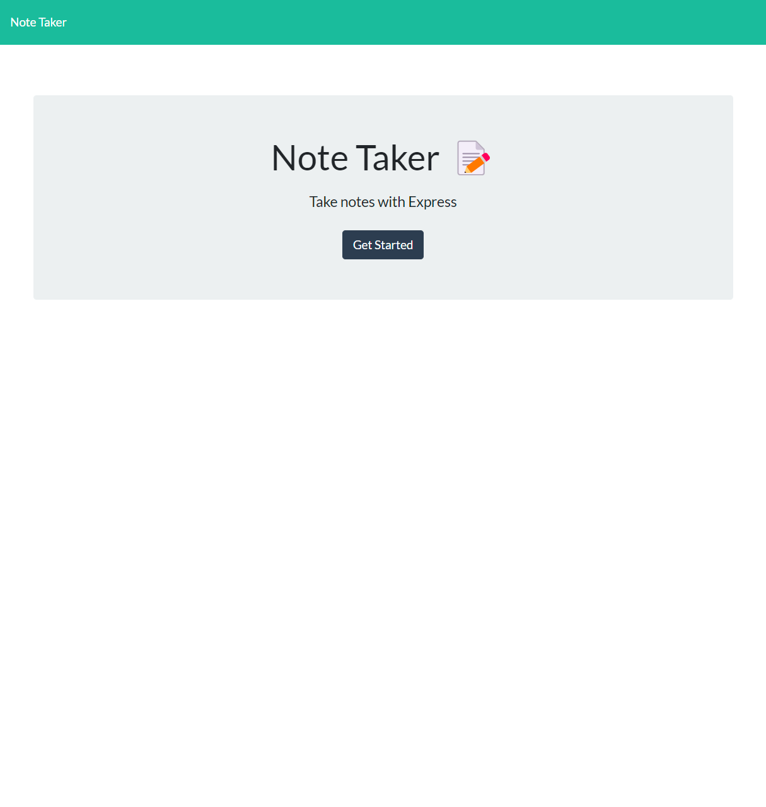
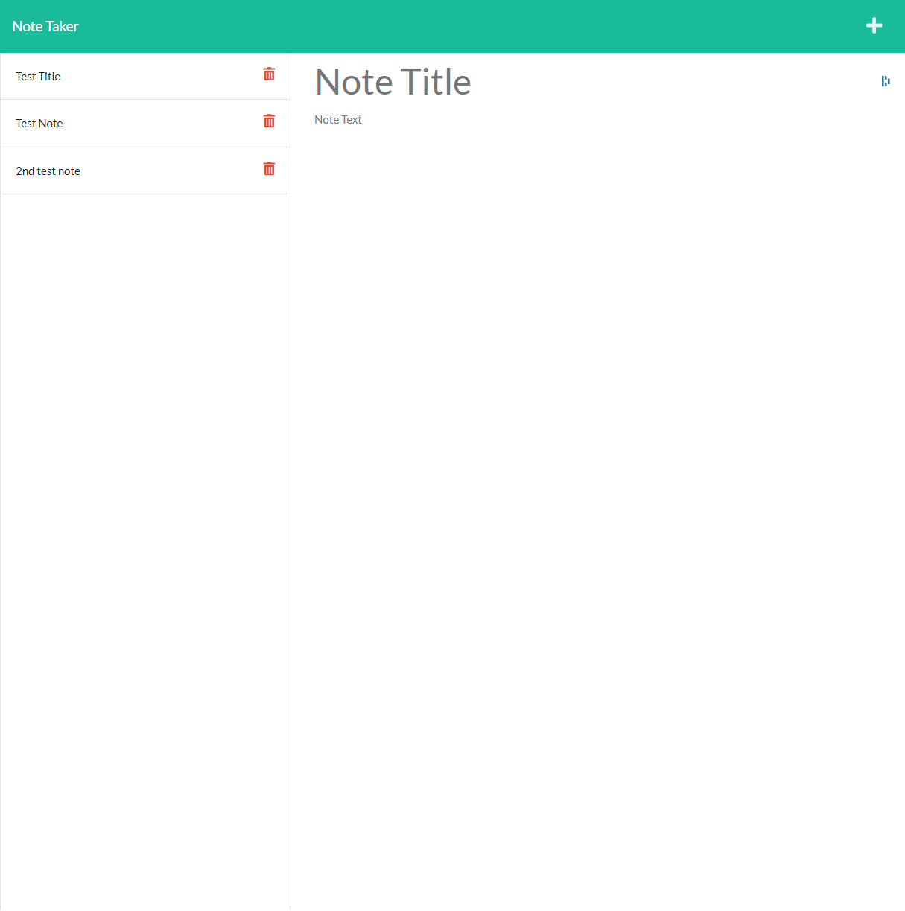

# CHLG-Note-Taker

_You can access more badges and their purposes at [shields.io](https://shields.io)_

## Description:

This application is built using Express.js backend and publish on Heroku.  This app allows an end user to write and save notes, and view which notes have been previously saved to the database.

----------------------------------

## Table of Contents:
- [Description](#description)
- [Installation](#installation)
- [Usage](#usage)
- [License](#license)
- [Questions](#questions)

----------------------------------

## Installation:

_Follow these steps to properly install this application:_

This application is hosted on the Heroku platform and can be accessed [here](https://chlg-note-taker.herokuapp.com/)

## Usage:

## License:

NOTICE: This application is covered by [MIT License](https://choosealicense.com/licenses/mit/).

## Questions:

- Github: [cangalet](https://github.com/cangalet)
- Email:  cangalet@gmail.com